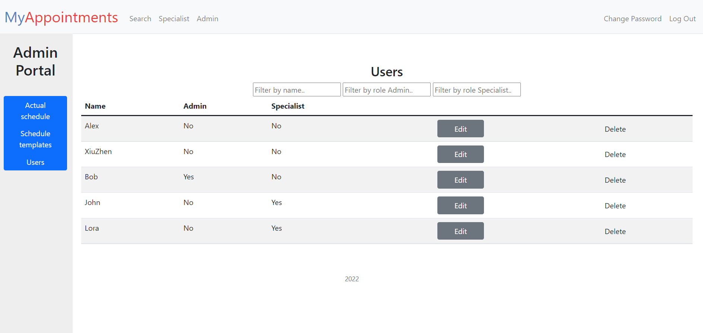
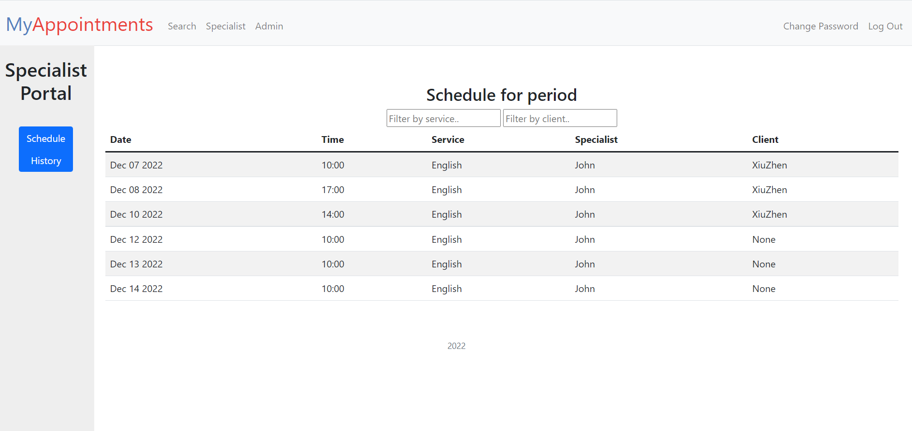
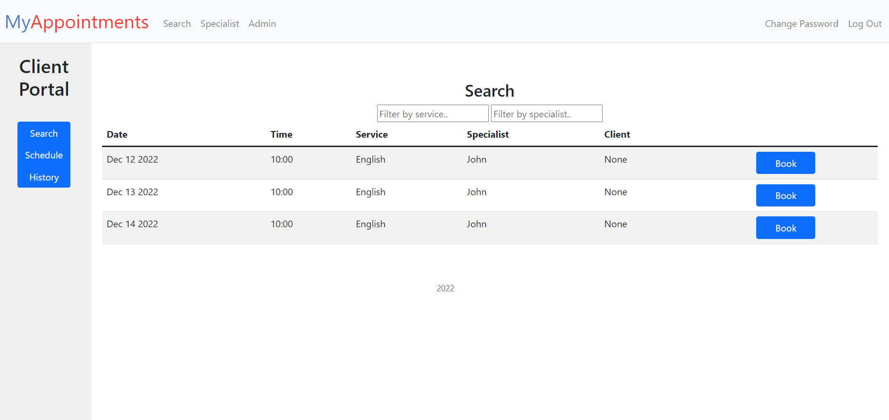

# MY APPOINTMENTS

#### Video Demo: [link](https://youtu.be/z05kT0MZKBQ)

#### Description:

This is the final project of the CS50 Introduction to Computer Sciense course.

**MyAppointments** is a full-stack web-application to make appointments which is quite simple and suitable for any small business such as educational courses, barbershops, consultants, private doctors etc.
Implemented user authentication and user roles – Admin, Specialist, Client.
Technologies used:
* Flask/Python,
* SQLite,
* JavaScript,
* HTML,
* CSS,
* Bootstrap.

**User interface**

The user can register by entering a username and password. Next, the user gets access to the client portal, which has a search table for available terms for booking. The table has filters by service type and specialist name. The user can make an appointment by clicking the Book button on the time slot you chosen.

User with Specialist role has the access to the Specialist Portal with information about planned appointments and history of appointments where this user is mentioned as a specialist.

User with Admin role has the access to Admin Portal where the user can read a full list of appointments regardless if their date, list of templates and list of users.

Admin can create a list of templates for each of specialists to create a schedule based on this templates. For example, a specialist works every day from Monday to Friday and has time slots at 8:00, 9:00, 10:00, therefore the admin can create 15 templates for this specialist by clicking the button Create Template 15 times. To create time slots available for booking it is enougth to input the start date of current week and specialist’s name and all the 15 slots will be created by clicking button Create Schedule.
Users make an appointments themself from index page. If necessary admin can make a booking for them using button Book and entering client’s name in Admin Portal for existing time slot or create a new time slot using the Create Booking button.
Admin can watch the list of users on Admin Portal, edit user’s name or role, delete a user as well.

  

**Database**
Database stores all users, appointments, specialists, templates. The fields are as follows:
* users (username, hash, is_admin, is_specialist, is_deleted)
* appointments (id, date, time, service_id, specialist_id, is_available, client_id)
* schedule_templates (id, day, time, service_id, specialist_id, is_available)
* services (id, name)

There are the following files and folders:
app.py finance.db helpers.py requirements.txt static/ templates/ flask-session/

**requirements.txt**
There are the necessary packages for this app – SC50, Flask, Flask-Session, requests

**app.py**
This file contains list of necessary imports, some configurations and all the routes.
CS50’s SQL module was imported to query the database myapp.db.
Most of routes have the decorator @login_required which means user must be logged in to visit these routes. Routes specialist and admin have decorators @admin_required and @specialist_required to rectrict the access depending on the user’s role.

_index_ – shows Client portal for the user with information about time slots available and appointments made (GET request) and used to make an appointment (via POST request). All the record from the database are splitted into two categories – before current date and after current date using function date_before_current. Then the records relate dto the future are used to populate two tables – Search (all available time slots) and Schedule (all bookings made by the current user).

_login_, _logout_, _register_, _change_password_ – this group of routes is used to sign in, log in and log out. user_id is stored in session to remember the user. Hash function is used to store users’ passwords in database. When users are registered they do not have admin role or specialist role by defolt (0 in the columns is_admin and is_specialist in database). User role can be changed by admin on Admin Portal. A user can change their password using change_password route.

_specialist_, _admin_ – these routes are used to show admin Portal and Specialist Portal. Similar to index recors from database are also splitted into two categories (before and after current date). Admin Portal contains also information about users.

_create_template_ and _delete_template_ – these routes are used by admin to create and delete schedule templates.

_create_schedule_, _create_appointment_, _book_by_admin_, _delete_appointment_ these routes are used by admin to create appointments in 3 different ways and delete them. Admin can create a list of appointments based on the templates using create_schedule, one appointment based on the template created before using book_by_admin, create a new time slot with appointment (without a template) using create_appointment.

_create_edit_user_, _delete_user_ – Admin can change user’s name and role and delete a user. If user is deleted the record in the database users become marked as 1 in the column is_deleted and this users will not appear in the list of users in the Admin Portal. At the same time, info about this user become available in the appointments database regarding past and future appointments.

**helpers.py**
There are several decorators and helping functions. Decorators login_required, admin_required, specialist_required are used to rescrict an access to the pages as mentioned above. apology is used in cases where the required information is missing from forms submitted by the user.
Regarding functions, they are used for changing the formattes of dates , for comparison of a date with current date.

**static/**
Contains CSS and JavaScript files.

**templates/**
There are a bunch of html pages based on Bootstrap. JavaScript functions were used to show and hide tables on index, admin and specialist pages and for filtering these tables as well.

**flask-session/**
Session files generated and stored in this folder because data is stored using filesystem in configurations in app.py.

**Possible improvements**
This is a simple CRM system which can have additional functions:
* Notificaitons to the specialist via email about new appointments
* Recording the total numer of hours worked by specialists for a period of time to calculate their remuneration
* Recording the revenue earned for the period, generating invoices for clients
* Integration of a payment system to get payments from clients (Stripe, Paypal etc).
